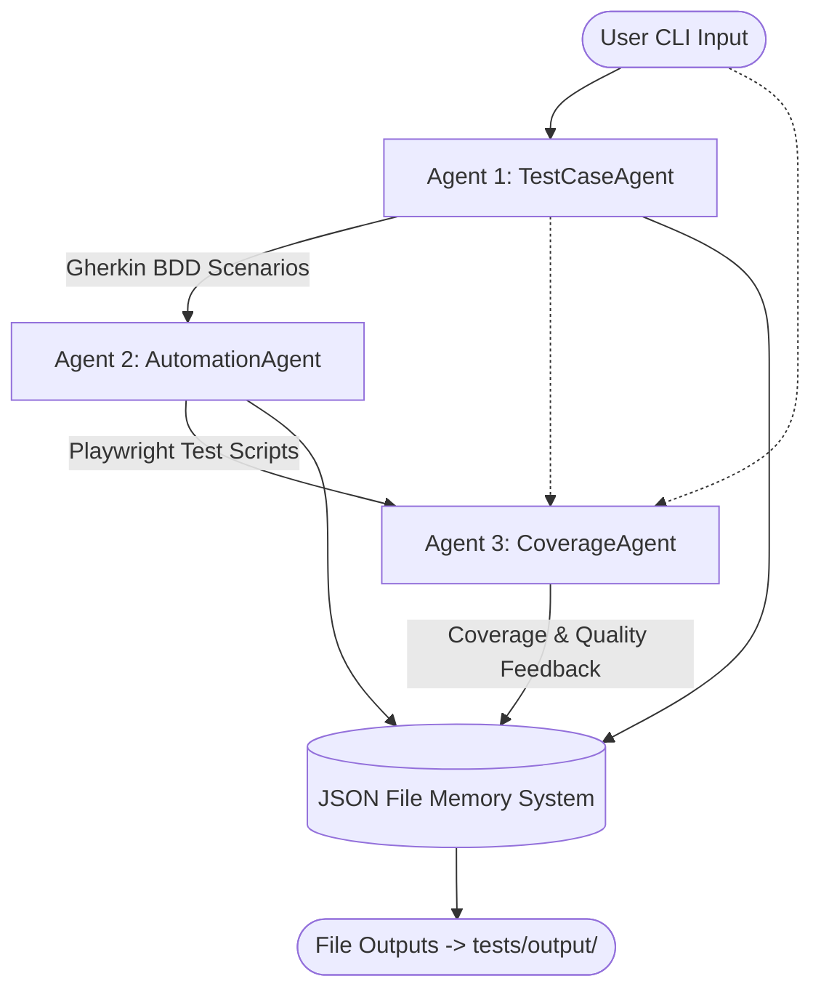

# Agent Flow Diagram

This document delineates the conversational state and step-by-step responsibilities in the TestPilot AI application.

## Flow Pipeline

## Step by Step Execution
1. User provides feature requirements in the standard Node.js terminal app.
2. App invokes **TestCaseAgent** function call directly with requirements. Returns BDD strings.
3. App invokes **AutomationAgent** passing the BDD strings. Returns JS test files.
4. App invokes **CoverageAgent** passing all context.
5. All outputs are synchronized into `memory.json`.
6. Final files are written to the `tests/output/` directory for developer inspection.
